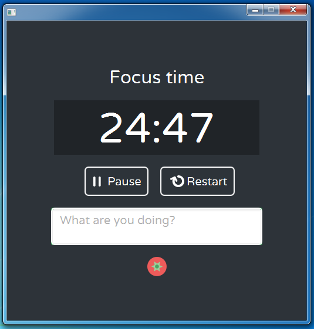

 JavaFx-Pomodoro
==================

Aplicacion [POMODORO](https://es.wikipedia.org/wiki/T%C3%A9cnica_Pomodoro) desarrollada en [JavaFX](http://docs.oracle.com/javase/8/javafx/interoperability-tutorial/fx_swing.htm#JFXIP561)

